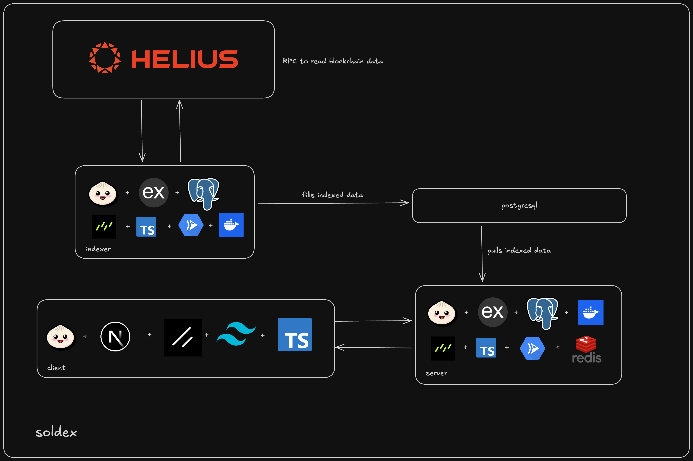

<h1 style="display: flex; align-items:center; gap:10px;">
SolDex 
</h1>

> Soldex indexes transactions from popular token creators in an efficently and reliably in a scalable manner using microservices, caching and cron jobs.

## Index

- [Tech Stack](#tech-stack)
- [Architecture](#architecture)
- [Local Setup](#local-setup)

## Tech Stack

- Client
  - Next.js
  - Tailwind
  - Typescript
  - Tanstack Query

- Server
  - Bun
  - Express.js
  - DrizzleORM
  - PostgreSQL
  - Redis
  - Docker
  - GCP

- Indexer
  - Bun
  - Express.js
  - DrizzleORM
  - PostgreSQL
  - Docker
  - GCP
  - Helius

## Architecture



## Local Setup

- Setup required environment variables
  - [services/indexer/.env.example](services/indexer/.env.example)
  - [services/server/.env.example](services/server/.env.example)
  - [services/.env.example](services/.env.example)
  - [client/.env.example](client/.env.example)

- Using provided script
  ```
  chmod +x start.sh && ./start.sh
  ```
- Use Docker
  ```
  docker compose up
  ```
